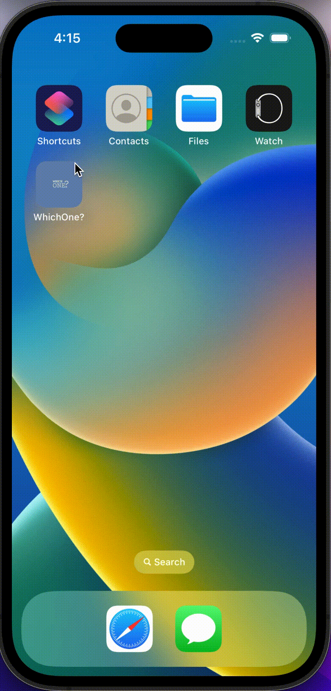

# WhichOne-Kmm


## ABOUT THE PROJECT

A mobile application where you can answer questions and see which TV series / movie character you are.  
And soon you will see it in the app store.

## TO ANDROID
[Android Screens](https://github.com/tfaki/WhichOne-Android)

## iOS SCREENS(Journey - Error View - Force Update)

<p align="center">
 
  
  
</p>
  
  <p align="center">
</p>


## TECH STACK
- Kotlin
- Swift
- SwiftUI
- Hilt
- Ktor
- Flow

## CONTACT

- [Linkedin](https://www.linkedin.com/in/talha-fakioglu/)
- [Twitter](https://twitter.com/talhafaki)
- [Medium](https://medium.com/@talhafaki)

```xml
Designed and developed by tfaki (Talha Fakioglu)

Licensed under the Apache License, Version 2.0 (the "License");
you may not use this file except in compliance with the License.
You may obtain a copy of the License at

   http://www.apache.org/licenses/LICENSE-2.0

Unless required by applicable law or agreed to in writing, software
distributed under the License is distributed on an "AS IS" BASIS,
WITHOUT WARRANTIES OR CONDITIONS OF ANY KIND, either express or implied.
See the License for the specific language governing permissions and
limitations under the License.
